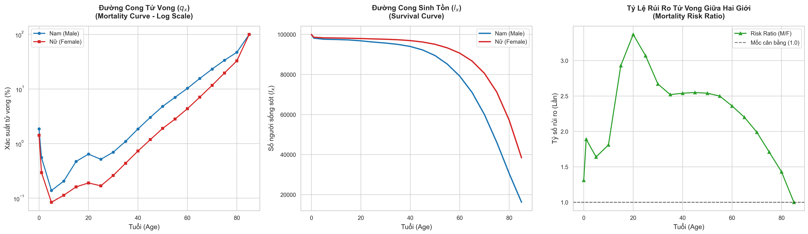
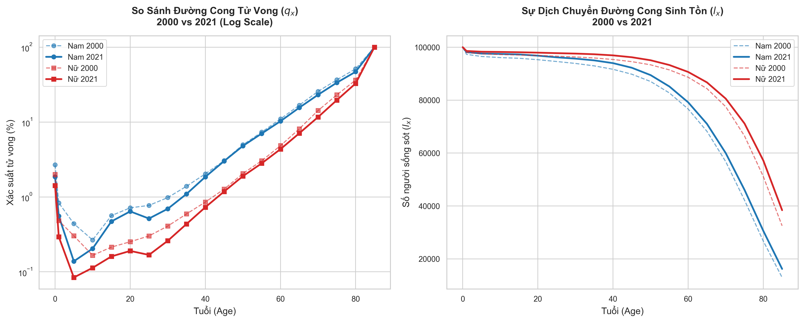

# Life Table & Mortality Analysis — Vietnam (2000 vs 2021)

Actuarial Science Portfolio · 

---

## Project Title & Abstract

This project constructs a complete abridged life table for the Vietnamese population from WHO mortality data, and analyses how Vietnam's mortality risk profile has shifted between 2000 and 2021. The core deliverable is an object-oriented Python model that derives the full set of actuarial survival functions from raw discrete mortality probabilities, validated against WHO benchmarks. Three findings with direct pricing relevance are identified: a sharp male excess mortality peak at age 20 (Risk Ratio 3.37×); a two-decade mortality improvement trend with divergent implications for term life versus annuity products; and a rectangularization of the survival curve that concentrates mortality risk in the 60+ bracket.

---

## Actuarial Methodology

Data were retrieved from the WHO GHO REST API (indicator `LIFE_0000000030`, country `VNM`) for 19 abridged age groups (0, 1–4, 5–9, …, 85+), both sexes, years 2000 and 2021.

A Python class `AbridgedLifeTable` was built to recursively interpolate the full life table column set from a raw q<sub>x</sub> input vector:

```
px  =  1 − qx
lx  →  lx+n  =  lx · px          (recursive, radix l0 = 100,000)
dx  =  lx · qx
nLx =  n · (lx − 0.5 · dx)       (UDD assumption within each interval)
Tx  =  Σ nLx                      (reverse cumulative sum)
ex  =  Tx / lx
```

Two boundary conditions were enforced explicitly:
- **Terminal group (85+):** q₈₅ = 1.0 by construction; the open-ended tail is handled via a configurable residual life expectancy parameter (e₈₅ = 5.5 years, WHO-consistent). Sensitivity of e₀ to this parameter is ±0.13 years across a plausible range — confirming the assumption has no material effect on results.
- **Data quality gate:** all q<sub>x</sub> values verified to lie strictly within [0, 1] before model execution.

---

## Key Demographic Shifts

**Accident hump — male excess mortality at young adult ages**  
The male q<sub>x</sub> curve deviates from the Gompertz trend between ages 15 and 25, peaking at a Risk Ratio of **3.37×** relative to females at age 20 and remaining above 2.5× through age 35. The female curve follows a clean Gompertz trajectory across the same range. The deviation is driven by behavioural and occupational risk factors concentrated in young adult males.

**Mortality improvement — 2000 vs 2021**  
Male e₀ rose from approximately 62 to 70 years over the two decades; female e₀ from ~67 to 78 years. The improvement is most pronounced in two age bands: infants/early childhood (ages 0–5) and working-age adults (ages 40–65), reflecting gains in maternal-infant healthcare and cardiovascular risk management.

**Rectangularization of the survival curve**  
Under 2021 mortality, both cohorts maintain over 90,000 survivors (per 100,000 radix) through age 50, followed by a steep drop-off in older age groups. Mortality risk is increasingly concentrated in the 60+ bracket — a structural shift with direct implications for reserve adequacy in long-duration contracts.

---

## Pricing & Reserving Implications

**Gender-distinct pricing (Term Life)**  
With the male-to-female risk ratio exceeding 2.5× continuously between ages 20 and 35, a gender-neutral term life rate materially overcharges female policyholders while undercharging males. Gender-differentiated pricing is an actuarial necessity for this product type, not a commercial preference.

**Mortality surplus vs longevity risk**  
The two findings point in opposite directions depending on the product line:
- *Term life:* sustained q<sub>x</sub> reductions create a mortality surplus if improvement continues. The primary risk is commercial — competitors with more current tables can undercut on premium.
- *Annuity and pension:* lower mortality extends payout periods. Female e₆₅ already reaches 18.09 years under 2021 mortality. Companies still pricing lifetime annuities on 2000-era tables face cumulative under-reserving as payouts outlast original assumptions — a direct solvency exposure.

**Static tables and the case for improvement factors**  
The 20-year gap between the two reference years illustrates why locking in a static mortality table is insufficient for long-duration products. The standard actuarial response is to project q<sub>x</sub> forward using mortality improvement scales rather than assuming today's rates persist. For products with 20–30 year payout horizons, the difference between a static and a projected table is a first-order solvency consideration, not a refinement.

---

## Results Summary

| Metric | Male | Female | Gap (F − M) |
|---|---|---|---|
| e₀ (life expectancy at birth) | 69.95 yrs | 78.19 yrs | +8.24 yrs |
| e₄₀ | 33.34 yrs | 40.28 yrs | +6.94 yrs |
| e₆₅ | 13.94 yrs | 18.09 yrs | +4.15 yrs |
| l₆₅ (survivors to age 65) | ~71,500 | ~84,200 | +12,700 |
| Peak Risk Ratio (q_M / q_F) | Age 20 — **3.37×** | — | — |

---

## Visualisations

**Vietnam 2021 — Mortality curve (log scale), survival curve, and gender risk ratio**



**2000 vs 2021 — Temporal comparison**



---

## Project Structure

```
life-table-project/
│
├── life_table.ipynb                          # Main notebook — all code and commentary
├── Vietnam_LifeTable_Summary_2021.xlsx       # Exported life table summary
├── vietnam_mortality_2021.png                # Figure 1 — 2021 analysis charts
├── vietnam_temporal_comparison_2000_2021.png # Figure 2 — temporal comparison
├── Vietnam_LifeTable_Report.pdf              # Full actuarial report
└── README.md
```

---

## Setup

```bash
git clone https://github.com/<your-username>/life-table-project.git
cd life-table-project

python -m venv venv
source venv/bin/activate        # Windows: venv\Scripts\activate
pip install pandas numpy matplotlib seaborn requests openpyxl jupyter
```

Open `life_table.ipynb` in VS Code or JupyterLab. No API key required — WHO GHO is a public endpoint.

---

## Data Source

World Health Organization — Global Health Observatory  
Indicator `LIFE_0000000030` · Country `VNM` · Years 2000, 2021  
https://www.who.int/data/gho/data/themes/mortality-and-global-health-estimates

---

## CV Reference

For CV/resume use, the following bullets describe this project at an appropriate technical level for an actuarial internship application:

> **Actuarial Science Project: Mortality Modeling & Life Table Construction (Vietnam 2000 vs 2021)**
> - Engineered an object-oriented Abridged Life Table model to recursively compute survival functions (l<sub>x</sub>, d<sub>x</sub>, L<sub>x</sub>, e<sub>x</sub>) from raw discrete probabilities, strictly enforcing UDD and terminal age boundary conditions.
> - Conducted longitudinal demographic analysis, quantifying a 20-year mortality improvement trend and its divergent financial impacts: mortality surplus in Term Life versus longevity risk exposure in Annuity reserves.
> - Modelled gender-based relative risk, identifying a 3.37× excess mortality peak in the young-adult male cohort and validating the actuarial case for gender-distinct pricing in term life products.

---

## Context

Project 1 of 3 in an actuarial portfolio built during Year 1 of an Actuarial Science programme.

- **Project 2** — Product cash flow model and net premium calculation for Term Life Insurance *(in progress)*
- **Project 3** — Lapse rate prediction combining actuarial assumptions and machine learning *(planned)*
